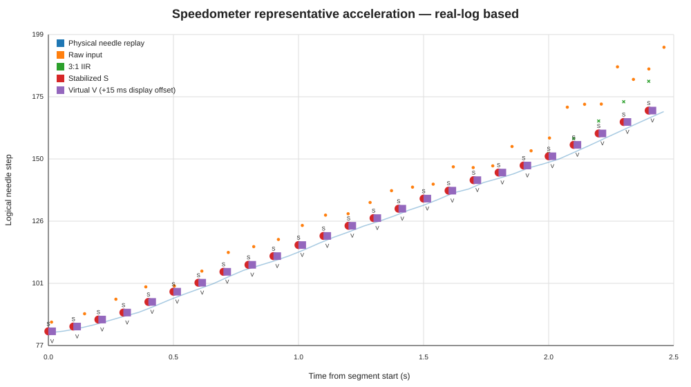

# Speedometer v2.1 Tuned 3:1 / スピードメーター v2.1 Tuned 3:1

This directory contains the maintained vehicle-validated Tuned 3:1 configuration for the DRV8833 / 1/16-microstep speedometer v2.1 architecture.

このディレクトリは、DRV8833・1/16マイクロステップ版スピードメーター v2.1 のうち、実車確認済みとして維持するTuned 3:1構成です。

## Parameters / パラメータ

```text
TARGET UP/DOWN       45 / 60 step/s
VIRTUAL VEL UP/DOWN  500 / 500 step/s
VIRTUAL ACC UP/DOWN  6000 / 6000 step/s²
MOTOR MAX SPEED      900 microstep/s
MOTOR ACCEL          8000 microstep/s²
Control interval     50 ms
Display IIR          3:1
STOP BAND            3 logical step
```

`3:1` means **previous filtered value : newest raw value**. It is not pulse division, mechanical gearing, or motor-position scaling.

`3:1` は **旧フィルタ値：新しいRaw値** の表示フィルタ重み比です。パルス分周、機械減速比、モーター位置倍率ではありません。

## Why these values? / なぜこの値か

The speedometer signal path is conceptually:

```text
Speed pulse -> Raw speed -> 50 ms IIR -> TARGET -> Virtual needle -> Motor -> Physical needle
```

The TARGET layer defines the desired display trajectory. The Virtual layer then converts the discrete 50 ms target updates into velocity/acceleration-controlled motion, while the Motor layer physically reproduces that trajectory.

TARGET層で表示したい針軌跡を作り、Virtual層で50 msごとの離散TARGET点を速度・加速度を持つ運動へ変換し、Motor層でその軌跡を物理針として再現します。

A key result of the real-vehicle log analysis is that the speedometer is mainly limited by the **display IIR response**, not by motor maximum speed.

実車ログ解析で最も重要だったのは、スピードメーターの応答を主に支配していたのが **Motor最大速度ではなく表示IIR** だったことです。

Representative acceleration analysis gave approximately:

```text
7:1 IIR: MAE vs raw ≈ 12.7 logical step
3:1 IIR: MAE vs raw ≈  6.4 logical step
```

Thus the `7:1 -> 3:1` change produced a much larger response improvement than increasing motor acceleration.

したがって `7:1 -> 3:1` の変更は、Motor加速度を増やす場合より明確に大きな応答改善をもたらしました。

## Motor capability / Motor能力

The maximum TARGET velocity is `45/60 logical step/s`. With the v2.1 motor-position conversion ratio `32/3`, the maximum velocity requirement is only about `640 microstep/s`.

TARGET最大速度は `45/60 logical step/s` です。v2.1のMotor位置換算比 `32/3` で換算すると、最大速度要求は約 `640 microstep/s` です。

The maintained motor maximum speed is `900 microstep/s`, so motor **speed** already has adequate margin.

維持値のMotor最大速度は `900 microstep/s` なので、速度については既に十分な余裕があります。

Representative 3:1 analysis showed a local TARGET acceleration requirement around `15000–16000 microstep/s²`. A trajectory-matched motor candidate would therefore be about `900 / 16000`, but simulation showed only a small end-to-end benefit:

一方、3:1での代表加速解析では、TARGET軌跡に局所的に約 `15000–16000 microstep/s²` の加速度要求が現れました。この意味では `900 / 16000` が軌跡能力に整合する候補ですが、最終表示改善は小さい結果でした。

```text
3:1 IIR + Motor 900 / 8000  : MAE ≈ 6.38 step
3:1 IIR + Motor 900 / 16000 : MAE ≈ 5.98 step
```

For this reason, `900 / 8000` remains the practical maintained value and the IIR change is treated as the primary response improvement. Raising motor acceleration would also transmit more small steady-state variation to the physical needle.

このため、実用維持値は `900 / 8000` のままとし、応答改善の主手段は3:1 IIRとします。またMotor加速度を上げると、定常時の細かな変動も実針へ伝わりやすくなるため、数値上の追従誤差だけでなく見え方も考慮しています。

## Representative vehicle-log behavior / 実車ログ上の代表挙動



The figure uses a representative acceleration segment from the real vehicle raw pulse log. `S` indicates stabilized-target points and `V` indicates virtual-needle points. The `V` markers are shifted by +15 ms **for display visibility only**.

図は実車Rawパルスログの代表加速区間を使用しています。`S` はStabilized target、`V` はVirtual needleです。`V` の点は識別性を高めるため表示上のみ +15 ms 横方向へずらしています。

The physical-needle trace is a replay/simulation result of the current control and motor model driven by the real raw-log segment; it is not a direct needle-position sensor measurement.

Physical needle軌跡は、実車Rawログ区間を入力として現在の制御・モーターモデルを再生した計算結果であり、針位置センサーによる直接実測ではありません。

## Positioning / 位置づけ

Tuned 3:1 is the response-oriented maintained configuration. Tuned 7:1 remains available for users who prefer stronger smoothing, and Original v2.1 remains available because its slower movement can appear subjectively smoother.

Tuned 3:1は応答性重視の維持構成です。より強い平滑性を重視する場合のTuned 7:1、および緩慢な動きが体感上滑らかに見えるOriginal v2.1も選択肢として残します。
