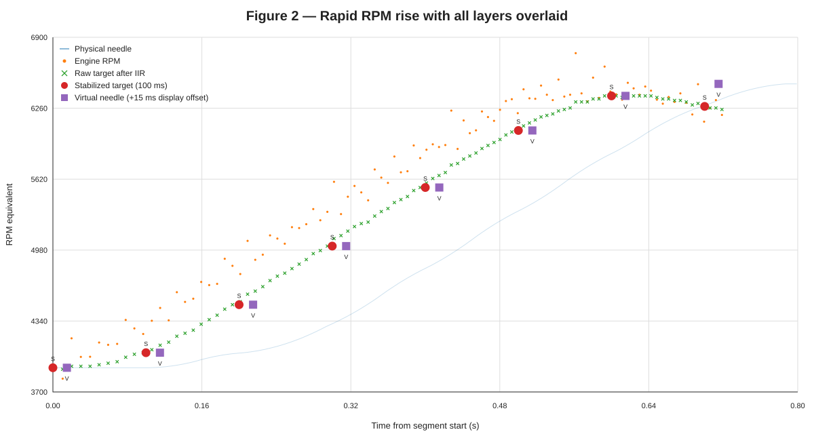

# Tachometer v2.1 Tuned / タコメーター v2.1 Tuned

This directory contains the maintained, vehicle-validated Tuned parameter configuration for the DRV8833 / 1/16-microstep tachometer v2.1 architecture.

このディレクトリは、DRV8833・1/16マイクロステップ版タコメーター v2.1 のうち、実車確認済みとして維持するTunedパラメータ構成です。

## Parameters / パラメータ

```text
TARGET UP/DOWN       425 / 160 step/s
VIRTUAL VEL UP/DOWN  425 / 160 step/s
VIRTUAL ACC UP/DOWN  2600 / 1500 step/s²
MOTOR MAX SPEED      4800 microstep/s
MOTOR ACCEL          32000 microstep/s²
Control interval     100 ms
Display IIR          7:1 per pulse
STOP BAND            5 logical step
```

## Why these values? / なぜこの値か

The tachometer signal path is conceptually:

```text
Tach pulse -> IIR -> TARGET -> Virtual needle -> Motor -> Physical needle
```

The upstream pulse-by-pulse `7:1` IIR suppresses short-period pulse variation, and the TARGET layer defines the display trajectory itself. Representative real-vehicle raw-log analysis showed a maximum TARGET velocity of roughly `400–425 logical step/s` and maximum TARGET acceleration of about `2900 logical step/s²`.

上流のパルス毎 `7:1` IIRで短周期のパルスばらつきを抑え、その後のTARGET層で表示したい針軌跡を作ります。代表的な実車Rawログ解析では、TARGET軌跡の最大速度は約 `400–425 logical step/s`、最大加速度は約 `2900 logical step/s²` でした。

### Representative behavior from the vehicle log / 実車ログ上の代表挙動



This figure uses the representative rapid-RPM-rise section of the actual vehicle raw pulse log. `S` marks Stabilized target points and `V` marks Virtual needle points. The `V` markers are shifted by +15 ms horizontally **for readability only**; the control timing itself is unchanged. The Physical needle trace is a replay/simulation of the v2.1 motor model driven by the real raw-log segment, not a direct needle-position sensor measurement.

この図は、実車Rawパルスログの代表急回転上昇区間を入力として作成しています。`S` はStabilized target、`V` はVirtual needleです。`V` は識別性のため表示上のみ横方向へ +15 msずらしており、実際の制御時刻は変更していません。Physical needle軌跡は、実車Rawログを入力としてv2.1のMotorモデルを再生したシミュレーション値であり、針位置センサーによる直接実測値ではありません。

The important point is that the pulse-derived input remains visibly irregular, while IIR and TARGET processing already create a much smoother display trajectory. The downstream motor therefore does not need to be used as another strong smoothing layer.

重要なのは、パルス由来の入力には明確なばらつきがある一方、IIRとTARGETを通過した段階では表示軌跡がかなり滑らかになっていることです。そのため、下流Motorをさらに強い平滑化層として使うのではなく、上流で作った軌跡を余計に鈍らせず再現する方針としています。

With the v2.1 motor-position conversion ratio `32/3`, the observed TARGET motion corresponds to approximately `4533 microstep/s` and `30933 microstep/s²`. The adopted `4800 / 32000` motor values therefore slightly cover the motion capability already present in the TARGET trajectory.

v2.1のMotor位置換算比 `32/3` で換算すると、観測されたTARGET運動は約 `4533 microstep/s`、`30933 microstep/s²` に相当します。このため `4800 / 32000` は、TARGET軌跡自体が持つ運動能力をわずかに上回る値として採用しています。

The design objective is **not** to make the motor reach and stop at every new 100 ms TARGET point as quickly as physically possible. A theoretical analysis of that different objective produced a much higher condition near `9600 / 192000`, but such aggressive point-to-point tracking can reintroduce the discrete 100 ms update behavior as repeated acceleration/deceleration of the physical needle. It is therefore not adopted here.

設計目的は、100 msごとに更新される各TARGET位置へ毎回最速で到達・停止させることではありません。その別要求では理論上 `9600 / 192000` 程度が必要になりますが、各離散点へ向けて急加速・急減速を繰り返すため、100 ms周期の離散性を実針へ戻す可能性があります。したがってTuned版には採用していません。

## Validation / 検証

This parameter set was first implemented in the private development test `tach_v2_1_motor_optimized_parameter_test`. The later motion-layer analysis was used to verify the physical meaning of the values and to confirm that the previously completed real-vehicle test remained consistent with the final design interpretation. It is now treated as the validated maintained Tuned configuration.

このパラメータセットはPrivate開発側の `tach_v2_1_motor_optimized_parameter_test` として先に実装・実車試験していました。その後の運動層解析で各値の物理的意味を整理し、実施済みの実車試験結果と最終設計解釈が整合することを確認したため、現在は検証済みの維持対象Tuned構成として扱います。

The Original v2.1 remains available because its slower response can appear subjectively smoother.

Original v2.1は、より緩慢な動きが体感上滑らかに見える場合があるため、選択肢として残します。
